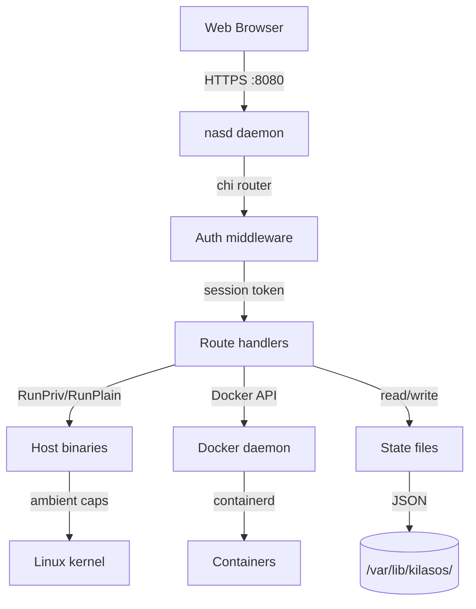
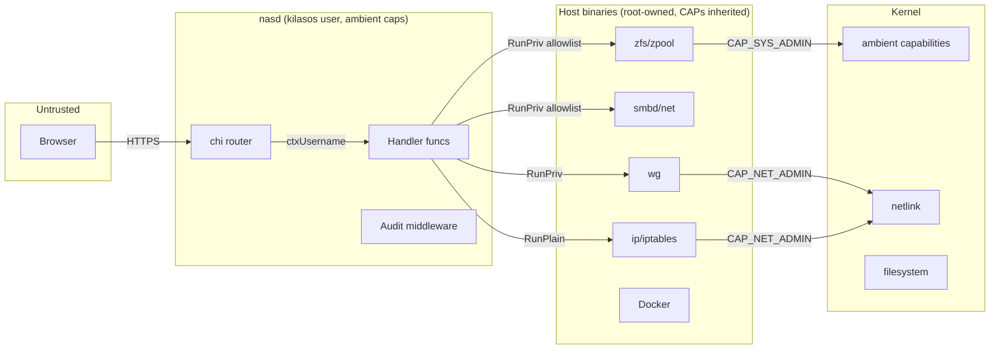
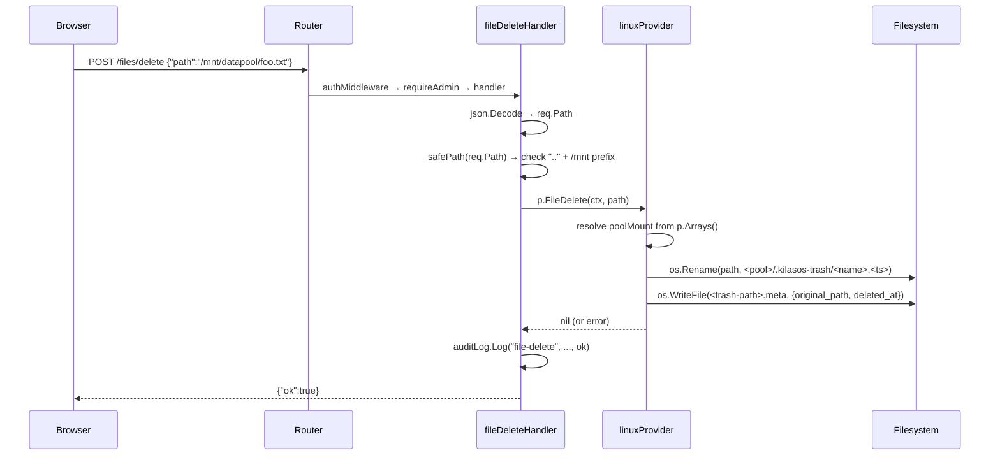

# Architecture

## Component overview

**Components:**
- **nasd** — single Go binary (~14 MB), HTTP server on :8080
- **chi v5 router** — dispatches ~300 routes to handler functions
- **Auth middleware** — validates Bearer tokens, injects `ctxUsername`/`ctxRole` into context
- **Audit middleware** — auto-logs every POST/PUT/DELETE/PATCH via `responseRecorder`
- **Handlers** — call `storage.Provider` methods; most return JSON via `writeJSON`
- **RunPriv/RunPlain** — privilege-separation layer in `internal/storage/priv.go`
- **State** — JSON files under `/var/lib/kilasos/` (users.json, apps.json, etc.)

## Trust boundaries

**Key boundaries:**

1. **Browser ↔ nasd** — HTTPS (optional, HTTP default on :8080). Session
   tokens in `Authorization: Bearer <token>` header. Public routes
   (`/auth/login`, `/auth/register`, `/share/<token>`) have no token.

2. **nasd ↔ Kernel** — Ambient capabilities (`CAP_SYS_ADMIN`, `CAP_NET_ADMIN`,
   `CAP_NET_BIND_SERVICE`, etc.) inherited from the systemd unit. `NoNewPrivileges=true`
   prevents setuid escalation. All privileged calls go through `RunPriv`
   which checks the allowlist in `priv.go`.

3. **nasd ↔ Host binaries** — `RunPriv` invokes only allowlisted paths
   (e.g. `/usr/sbin/zpool`, `/usr/bin/wg`). `RunPlain` is used for
   non-privileged binaries (e.g. `hostname`, `lsblk`).

4. **Handlers ↔ State files** — JSON under `/var/lib/kilasos/`, mode
   0600 for secrets (`auth_tokens.json`), 0644 for configs. Path is
   `ReadWritePaths`-gated in the systemd unit.

5. **safePath gating** — all file operations (upload, download, delete,
   zip, trash, search) validate paths through `safePath()` which rejects
   `..` traversal and requires the path to start with `/mnt/`.

## Data flow — POST /files/delete

**Auth gate:** `requireAdmin(w, r)` reads `ctxRole` from context (set
by auth middleware). Non-admin requests return 403 before reaching the
provider.

**safePath gate:** `strings.Contains(path, "..")` → reject.
`filepath.Clean(path)` → must start with `/mnt/`.

**Per-pool trash:** `FileDelete` determines the originating pool's
mount path from `p.Arrays()`, moves the file to
`/mnt/<pool>/.kilasos-trash/`, and writes a `.meta` sidecar with the
original absolute path for accurate restore.

**Audit log:** both success and failure paths call
`auditLog.LogEnriched(...)` with the caller, action, resource path, IP,
and OK status. The audit middleware auto-logs the same request as
`POST /api/v1/files/delete`.
